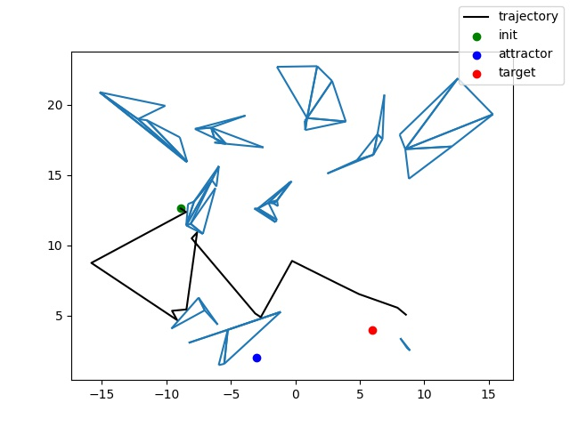

# DOPEr: dope af

## Example commands

Start training
```buildoutcfg
python3.8 ./scripts/train.py -c ./configs/jax_ball.yaml
```

The scripts and notebooks are in `./scripts` folder

No tests yet

Sample maps are in the `assets` folder. We use `.svg` vector maps and manage assets with git-lfs


